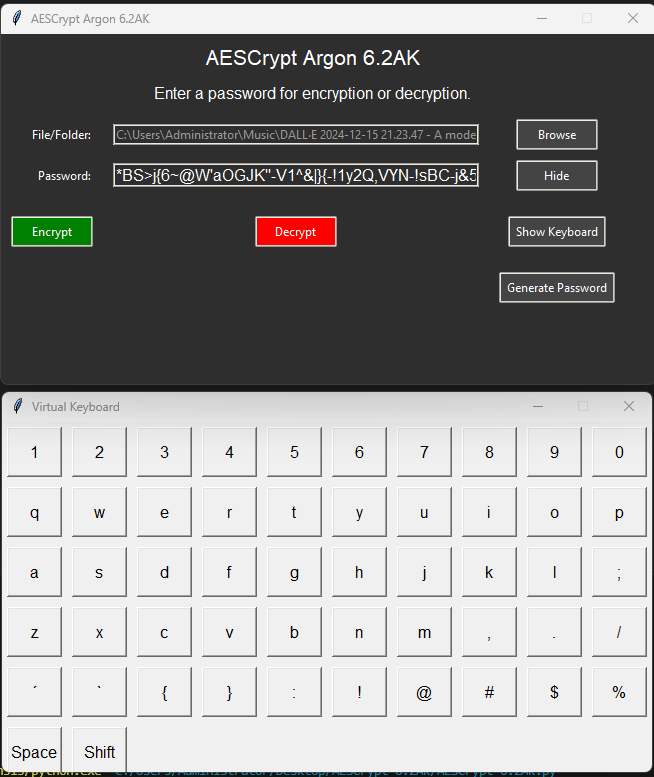

# AESCrypt Argon 6.2AK (Anti-Keylogger)

**AESCrypt Argon 6.2AK** is an advanced encryption tool designed for secure file and folder encryption and decryption. This version enhances security with the **AK (Anti-Keylogger)** feature, along with additional improvements and updates to existing methods, offering even more robust protection for your sensitive data. By incorporating the latest in password hashing with Argon2 and AES-256 for encryption, AESCrypt Argon 6.2AK is the ultimate tool for those who prioritize privacy and security in their digital lives.



[Visit the AESCrypt Website](https://aescrypt-argon.netlify.app/)

## Table of Contents

1. [Overview](#overview)
2. [Features](#features)
3. [Installation](#installation)
   - [Prerequisites](#prerequisites)
   - [Cloning the Repository](#cloning-the-repository)
   - [Installing Dependencies](#installing-dependencies)
4. [Download](#download)
5. [Usage](#usage)
   - [Launching the Application](#launching-the-application)
   - [User Interface Overview](#user-interface-overview)
   - [Encrypting Files](#encrypting-files)
   - [Decrypting Files](#decrypting-files)
   - [Encrypting Folders](#encrypting-folders)
6. [Troubleshooting](#troubleshooting)
   - [Common Issues](#common-issues)
   - [Error Messages](#error-messages)
7. [Security Considerations](#security-considerations)
8. [Contributing](#contributing)
9. [License](#license)
10. [Contact](#contact)

## Overview

**AESCrypt Argon 6.2AK** is a robust tool for file and folder encryption, utilizing the cutting-edge **Argon2 algorithm** for password hashing alongside **AES-256 encryption** to keep your data safe. This release introduces **AK (Anti-Keylogger)** protection, ensuring that your sensitive input remains secure from keyloggers while using the application. It’s designed for both professionals and casual users who require an easy-to-use, highly secure, and effective encryption tool.

## Features

- **File Encryption**: Encrypts files individually using AES-256 with strong password protection.
- **File Decryption**: Decrypts files previously encrypted by AESCrypt with the correct password.
- **Batch Encryption**: Supports bulk file encryption by encrypting all files in a selected folder.
- **Random Byte Padding**: Adds random padding to encrypted files, concealing their actual size and enhancing security.
- **Password Generation**: Generates strong, unique passwords for enhanced protection.
- **User-Friendly GUI**: Modern interface for easy use, featuring a dark theme and intuitive layout.
- **No Console Window**: Provides a professional, clean, and streamlined experience without any console window interruptions.
- **Secure File Deletion**: Ensures securely deleted files cannot be recovered by overwriting them multiple times.
- **Metadata Encryption**: Secures metadata to prevent exposure of sensitive information.
- **HMAC Integrity**: Verifies file integrity using HMAC, ensuring accurate encryption and decryption.
- **Cross-Platform Support**: Compatible across Windows and Linux operating systems.
- **Enhanced Security Features**:
  - Argon2 hashing is enhanced with a time cost for robust password security.
  - Added multiple overwrite passes for file deletion.
  - Stronger salting methods in Argon2 for better security.
  - Memory zeroing to prevent leakage of sensitive data.
  - **AK (Anti-Keylogger)**: Blocks keyloggers from intercepting user keystrokes during encryption and decryption processes.
- **Improved User Interface**: More responsive, with tooltips and a better layout for faster workflows.

## Installation

### Prerequisites

Ensure Python is installed on your system. You can download Python from [python.org](https://www.python.org/downloads/) (check the box to add Python to your PATH during installation).

### Cloning the Repository

To get the latest version of **AESCrypt Argon 6.2AK**, clone the repository using Git:

```bash
git clone https://github.com/victormeloasm/AESCrypt.git
```

### Installing Dependencies

Navigate to the repository folder and install dependencies via `pip`:

```bash
pip install -r requirements.txt
```

## Download

The latest release of **AESCrypt Argon 6.2AK** is available for both Windows and Linux.

- **Release Page**: [AESCrypt Argon 6.2AK Release](https://github.com/victormeloasm/AESCrypt/releases/tag/ArgonF)
- **Windows Download**: [AESCrypt Windows v6.2AK](https://github.com/victormeloasm/AESCrypt/releases/download/ArgonF/AEScrypt_Windows_v6.2AK.zip)
- **Linux Download**: [AESCrypt Linux v6.2AK](https://github.com/victormeloasm/AESCrypt/releases/download/ArgonF/AEScrypt_Linux_v6.2AK.zip)

## Usage

### Launching the Application

- **If Using Python**: Run the script by executing:
  ```bash
  python AESCrypt.py
  ```

- **If Compiled to Executable**: Double-click on the `.exe` file to launch AESCrypt.

### User Interface Overview

The updated AESCrypt 6.2AK interface features the following:

- **File/Folder Selection**: Use "Browse File" or "Browse Folder" to choose the files/folders you wish to encrypt or decrypt.
- **Password Input**: Enter a secure password or use "Generate Password" for a random, strong password.
- **Action Buttons**: Simple buttons for encryption, decryption, and password management.

### Encrypting Files

1. **Select the File**: Choose the file to encrypt via "Browse File."
2. **Enter Password**: Either type a password or use "Generate Password."
3. **Encrypt**: Press "Encrypt" to save the encrypted version in the same directory.

### Decrypting Files

1. **Select Encrypted File**: Choose the encrypted `.aes` file to decrypt.
2. **Enter the Password**: Provide the original password used for encryption.
3. **Decrypt**: Click "Decrypt" to restore the file to its original form.

### Encrypting Folders

1. **Select Folder**: Choose the folder containing files for batch encryption.
2. **Enter Password**: Use an existing or generate a new password.
3. **Encrypt**: Click "Encrypt" to encrypt all files inside the folder.

## Troubleshooting

### Common Issues

- **Incorrect Password**: If you see a password mismatch error, ensure you're entering the correct password.
- **File Not Found**: Ensure the file path is correct and that your permissions are sufficient.

### Error Messages

- **"Integrity Check Failed"**: Verify file integrity and password. The file may have been tampered with.

## Security Considerations

- **Password Safety**: Always create strong and unique passwords for encryption.
- **Backup**: Keep your original unencrypted files in a safe backup.
- **Environment**: Use AESCrypt only on secure, trusted systems to avoid compromises.

## Contributing

We welcome contributions! If you'd like to improve AESCrypt or fix bugs, here’s how to get involved:

1. **Fork the Repository**: Create your own fork on GitHub.
2. **Create a Branch**: Develop your changes in a separate branch.
3. **Submit a Pull Request**: Once you're happy with your changes, submit a pull request.

## License

Licensed under the MIT License. Please see the [LICENSE](LICENSE) file for more details.

## Contact

For any inquiries, issues, or support, please contact us at [victormeloasm@gmail.com](mailto:victormeloasm@gmail.com).

---

This README reflects the newest version of the software, including the **Anti-Keylogger** (AK) security features, enhanced capabilities, and updated download links. Let me know if you'd like further changes!
