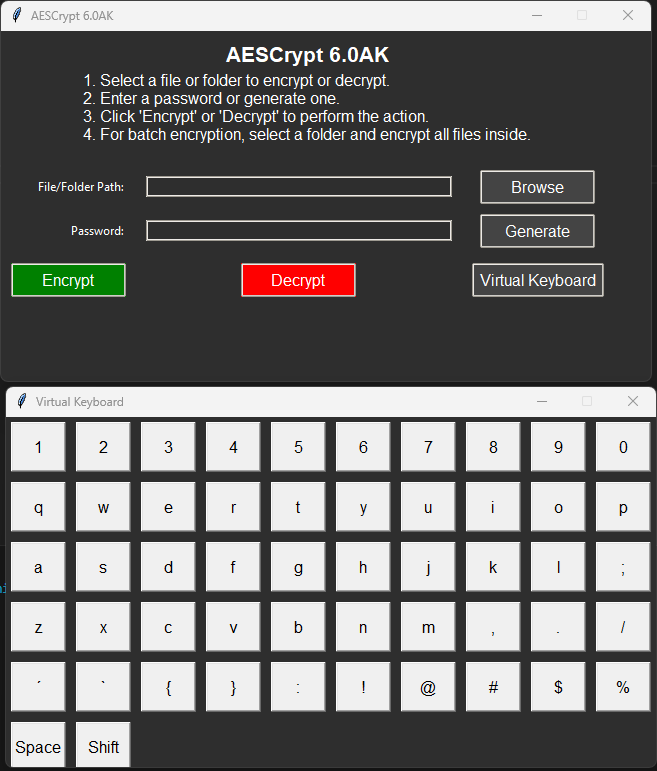

# AESCrypt Argon 6.0AK

**AESCrypt Argon 6.0AK** is an advanced encryption tool designed for secure file and folder encryption and decryption. It uses modern cryptographic methods, including Argon2 for password hashing and AES-256 for encryption, ensuring robust protection for sensitive data. This version introduces the **AK (Anti-Keylogger)** feature for enhanced security and several other improvements. This document provides an in-depth guide on installation, usage, and troubleshooting.



[Visit the AESCrypt Website](https://aescrypt-argon.netlify.app/)

## Table of Contents

1. [Overview](#overview)
2. [Features](#features)
3. [Installation](#installation)
   - [Prerequisites](#prerequisites)
   - [Cloning the Repository](#cloning-the-repository)
   - [Installing Dependencies](#installing-dependencies)
4. [Download](#download)
5. [Usage](#usage)
   - [Launching the Application](#launching-the-application)
   - [User Interface Overview](#user-interface-overview)
   - [Encrypting Files](#encrypting-files)
   - [Decrypting Files](#decrypting-files)
   - [Encrypting Folders](#encrypting-folders)
6. [Troubleshooting](#troubleshooting)
   - [Common Issues](#common-issues)
   - [Error Messages](#error-messages)
7. [Security Considerations](#security-considerations)
8. [Contributing](#contributing)
9. [License](#license)
10. [Contact](#contact)

## Overview

**AESCrypt Argon 6.0AK** is both a command-line and GUI-based tool for file and folder encryption and decryption. It employs the Argon2 algorithm for password hashing and AES-256 encryption for maximum protection. The **AK (Anti-Keylogger)** feature has been added to enhance security against potential keylogging threats, making this version significantly more secure.

## Features

- **File Encryption**: Encrypts individual files with AES-256 encryption using a secure, hashed password.
- **File Decryption**: Decrypts files previously encrypted with AESCrypt.
- **Batch Encryption**: Encrypts all files within a selected folder, simplifying bulk encryption tasks.
- **Random Byte Padding**: Automatically adds at least 1MB of random bytes to the encrypted files, disguising their actual size for enhanced security.
- **Password Generation**: Generates strong, random passwords for enhanced security.
- **User-Friendly GUI**: Modern, dark-themed graphical user interface for an intuitive user experience.
- **No Console Window**: Operates without a console window, providing a clean and professional interface.
- **Secure File Deletion**: Overwrites original files with random data before deletion to prevent unauthorized recovery.
- **Metadata Encryption**: Protects sensitive file metadata from exposure.
- **HMAC for Integrity**: Utilizes HMAC to verify data integrity during encryption and decryption.
- **Cross-Platform Compatibility**: Works seamlessly across different operating systems.
- **Improved Security Features**:
  - Increased Argon2 time cost for stronger password hashing.
  - Multiple overwrite passes for secure file deletion.
  - Enhanced salting in Argon2 for added security.
  - Memory zeroing to prevent sensitive data leakage.
  - **AK (Anti-Keylogger)**: A feature designed to prevent keyloggers from capturing sensitive information by disguising keyboard input, ensuring higher security during encryption and decryption.

## Installation

### Prerequisites

- **Python**: Ensure Python is installed on your system. You can download it from [python.org](https://www.python.org/downloads/). During installation, check the box to add Python to your PATH.

### Cloning the Repository

To get the latest version of AESCrypt Argon 6.0AK, you can clone the repository using Git:

```bash
git clone https://github.com/victormeloasm/AESCrypt.git
```

### Installing Dependencies

Navigate to the directory where `requirements.txt` is located and install the necessary Python packages using pip:

```bash
pip install -r requirements.txt
```

This will install all the dependencies required for AESCrypt Argon 6.0AK to function correctly.

## Download

You can download the latest release of **AESCrypt Argon 6.0AK** from the GitHub repository. The release package includes the compiled executable and all necessary files.

- **Release Page:** [AESCrypt Argon 6.0AK Release](https://github.com/victormeloasm/AESCrypt/releases/tag/ArgonAK)
- **Download for Windows:** [AESCrypt Windows v6.0AK](https://github.com/victormeloasm/AESCrypt/releases/download/ArgonAK/AEScrypt_Windows_v6.0AKB.zip)
- **Download for Linux:** [AESCrypt Linux v6.0AK](https://github.com/victormeloasm/AESCrypt/releases/download/ArgonAK/AEScrypt_Linux_v6.0AK.zip)

## Usage

### Launching the Application

To start AESCrypt Argon 6.0AK:

- **If Using Python**: Execute the script directly:
  ```bash
  python AESCrypt.py
  ```

- **If Compiled to Executable**: Double-click the `.exe` file generated by PyInstaller.

### User Interface Overview

The AESCrypt Argon 6.0AK interface is designed to be intuitive and user-friendly:

- **File/Folder Path**: A text field and browse button to select files or folders for encryption or decryption.
- **Password Entry**: A field to input or generate a strong password.
- **Action Buttons**: Buttons to initiate encryption, decryption, or password generation.

### Encrypting Files

1. **Select a File**: Click on "Browse File" to choose the file you want to encrypt.
2. **Enter Password**: Type a secure password into the password field or click "Generate Password" to create a strong one.
3. **Encrypt**: Click the "Encrypt" button. The encrypted file will be saved with a `.aes` extension in the same location as the original file.

### Decrypting Files

1. **Select an Encrypted File**: Click on "Browse File" to choose the `.aes` file you wish to decrypt.
2. **Enter Password**: Provide the password used during the encryption process.
3. **Decrypt**: Click the "Decrypt" button. The decrypted file will be saved with its original filename, replacing the `.aes` extension.

### Encrypting Folders

1. **Select a Folder**: Click on "Browse Folder" to choose the folder containing files to encrypt.
2. **Enter Password**: Enter a password or generate a new one.
3. **Encrypt**: Click "Encrypt" to start the encryption process. All files within the selected folder will be encrypted.

## Troubleshooting

### Common Issues

- **File Not Found**: Verify the file or folder path is correct and that you have the necessary permissions to access it.
- **Password Mismatch**: Ensure that the password you are using matches the one used during encryption.

### Error Messages

- **"File Integrity Check Failed"**: Indicates that the file might be corrupted or tampered with. Double-check the password and file integrity.

## Security Considerations

- **Password Management**: Always use strong, unique passwords for encryption. Avoid reusing passwords across different applications.
- **Data Handling**: Make sure files are properly managed and backed up to prevent accidental loss or corruption.
- **Environment**: Run the application in a secure environment and avoid using it on compromised systems.

## Contributing

Contributions to AESCrypt Argon 6.0AK are welcome! If you have improvements, bug fixes, or new features to suggest, please follow these steps:

1. **Fork the Repository**: Create your own fork of the repository.
2. **Create a Branch**: Work on your changes in a new branch.
3. **Submit a Pull Request**: Share your changes with the community by submitting a pull request.

## License

This project is licensed under the MIT License. For more information, please review the [LICENSE](LICENSE) file included in this repository.

## Contact

For any questions, issues, or support related to AESCrypt Argon 6.0AK, please reach out to us at [victormeloasm@gmail.com](mailto:victormeloasm@gmail.com).
