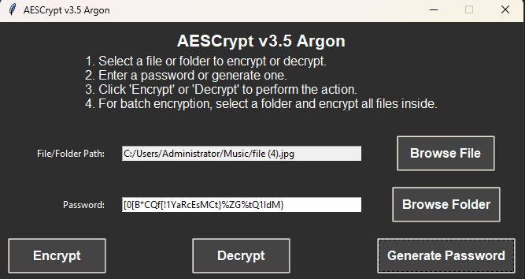

# AESCrypt v3.5 Argon

**AESCrypt v3.5 Argon** is a sophisticated tool designed for secure file and folder encryption and decryption. Utilizing state-of-the-art cryptographic methods, including Argon2 for password hashing and AES-256 for encryption, this application ensures robust protection for your sensitive data. This document provides a comprehensive guide on how to install, use, and troubleshoot AESCrypt v3.5 Argon.



## Table of Contents

1. [Overview](#overview)
2. [Features](#features)
3. [Installation](#installation)
   - [Prerequisites](#prerequisites)
   - [Cloning the Repository](#cloning-the-repository)
   - [Installing Dependencies](#installing-dependencies)
4. [Usage](#usage)
   - [Launching the Application](#launching-the-application)
   - [User Interface Overview](#user-interface-overview)
   - [Encrypting Files](#encrypting-files)
   - [Decrypting Files](#decrypting-files)
   - [Encrypting Folders](#encrypting-folders)
5. [Troubleshooting](#troubleshooting)
   - [Common Issues](#common-issues)
   - [Error Messages](#error-messages)
6. [Security Considerations](#security-considerations)
7. [Contributing](#contributing)
8. [License](#license)
9. [Contact](#contact)

## Overview

**AESCrypt v3.5 Argon** is a command-line and GUI-based tool designed for the encryption and decryption of files and folders. It leverages the Argon2 algorithm for secure password hashing and AES-256 for robust encryption. With a focus on security and ease of use, AESCrypt v3.5 Argon provides a streamlined solution for protecting your sensitive information.

## Features

- **File Encryption**: Encrypts individual files with AES-256 encryption using a secure, hashed password.
- **File Decryption**: Decrypts files previously encrypted with AESCrypt.
- **Batch Encryption**: Encrypts all files within a selected folder, simplifying bulk encryption tasks.
- **Password Generation**: Generates strong, random passwords for enhanced security.
- **User-Friendly GUI**: Modern, dark-themed graphical user interface for an intuitive user experience.
- **No Console Window**: Operates without a console window, providing a clean and professional interface.
- **Secure File Deletion**: Overwrites original files with random data before deletion to prevent unauthorized recovery.
- **Metadata Encryption**: Protects sensitive file metadata from exposure.
- **HMAC for Integrity**: Utilizes HMAC to verify data integrity during encryption and decryption.
- **Cross-Platform Compatibility**: Works seamlessly across different operating systems.

## Installation

### Prerequisites

- **Python**: Ensure Python is installed on your system. You can download it from [python.org](https://www.python.org/downloads/). During installation, check the box to add Python to your PATH.

### Cloning the Repository

To get the latest version of AESCrypt v3.5 Argon, you can clone the repository using Git:

```bash
git clone https://github.com/victormeloasm/AESCrypt.git
```

### Installing Dependencies

Navigate to the directory where `requirements.txt` is located and install the necessary Python packages using pip:

```bash
pip install -r requirements.txt
```

This will install all the dependencies required for AESCrypt v3.5 Argon to function correctly.

## Download

You can download the latest release of **AESCrypt v3.5 Argon** from the GitHub repository. The release package includes the compiled executable and all necessary files.

- **Latest Release**: [Download Release](https://github.com/victormeloasm/AESCrypt/releases/tag/Argon)
- **Executable File**: [Download AEScrypt_Windows_v3.5_Argon.zip](https://github.com/victormeloasm/AESCrypt/releases/download/Argon/AEScrypt_Windows_v3.5A.zip)
- **Linux .py File**: [Download AEScrypt_Linux_v3.5_Argon.zip](https://github.com/victormeloasm/AESCrypt/releases/download/Argon/AEScrypt_Linux_v3.5A.zip)

Please refer to the [Release Page](https://github.com/victormeloasm/AESCrypt/releases/tag/Argon) for detailed information about the release.

## Usage

### Launching the Application

To start AESCrypt v3.5 Argon:

- **If Using Python**: Execute the script directly:
  ```bash
  python AESCrypt.py
  ```
- **If Compiled to Executable**: Double-click the `.exe` file generated by PyInstaller.

### User Interface Overview

The AESCrypt v3.5 Argon interface is designed to be intuitive and user-friendly:

- **File/Folder Path**: A text field and browse button to select files or folders for encryption or decryption.
- **Password Entry**: A field to input or generate a strong password.
- **Action Buttons**: Buttons to initiate encryption, decryption, or password generation.

### Encrypting Files

1. **Select a File**: Click on "Browse File" to choose the file you want to encrypt.
2. **Enter Password**: Type a secure password into the password field or click "Generate Password" to create a strong one.
3. **Encrypt**: Click the "Encrypt" button. The encrypted file will be saved with a `.aes` extension in the same location as the original file.

### Decrypting Files

1. **Select an Encrypted File**: Click on "Browse File" to choose the `.aes` file you wish to decrypt.
2. **Enter Password**: Provide the password used during the encryption process.
3. **Decrypt**: Click the "Decrypt" button. The decrypted file will be saved with its original filename, replacing the `.aes` extension.

### Encrypting Folders

1. **Select a Folder**: Click on "Browse Folder" to choose the folder containing files to encrypt.
2. **Enter Password**: Enter a password or generate a new one.
3. **Encrypt**: Click "Encrypt" to start the encryption process. All files within the selected folder will be encrypted.

## Troubleshooting

### Common Issues

- **File Not Found**: Verify the file or folder path is correct and that you have the necessary permissions to access it.
- **Password Mismatch**: Ensure that the password you are using matches the one used during encryption.

### Error Messages

- **"File Integrity Check Failed"**: Indicates that the file might be corrupted or tampered with. Double-check the password and file integrity.

## Security Considerations

- **Password Management**: Always use strong, unique passwords for encryption. Avoid reusing passwords across different applications.
- **Data Handling**: Make sure files are properly managed and backed up to prevent accidental loss or corruption.
- **Environment**: Run the application in a secure environment and avoid using it on compromised systems.

## Contributing

Contributions to AESCrypt v3.5 Argon are welcome! If you have improvements, bug fixes, or new features to suggest, please follow these steps:

1. **Fork the Repository**: Create your own fork of the repository.
2. **Create a Branch**: Work on your changes in a new branch.
3. **Submit a Pull Request**: Share your changes with the community by submitting a pull request.

## Security Module

## Features

- **AES-256-GCM Encryption**: 
  - Implements AES-256 in Galois/Counter Mode (GCM), providing both confidentiality and integrity. This mode ensures that encrypted data remains secure against unauthorized access while allowing for tamper detection.

- **Key Derivation with Argon2id**:
  - Utilizes Argon2id for password hashing, which is resistant to GPU attacks and side-channel attacks. Configurable parameters (time cost, memory cost, and parallelism) allow users to tailor security based on their needs.

- **HMAC for Data Integrity**:
  - Employs HMAC (Hash-based Message Authentication Code) to verify the integrity of encrypted data. During decryption, an HMAC is checked to confirm that the data has not been altered, protecting against tampering.

- **Secure File Deletion**:
  - Overwrites original files with random data before deletion, ensuring that sensitive information cannot be recovered using standard recovery techniques.

- **Salting and Initialization Vectors**:
  - Each encryption operation generates a unique salt and IV, ensuring that identical plaintexts do not result in identical ciphertexts. This enhances security by preventing pattern recognition in encrypted data.

- **User-Generated Passwords**:
  - Provides a password generation feature that creates strong, random passwords, helping users avoid weak passwords that are easily guessable.

- **Batch Encryption**:
  - Allows for the encryption of entire folders, simplifying the process of securing multiple files while maintaining robust individual file encryption standards.

- **Error Handling and Logging**:
  - Robust error handling mechanisms ensure that users are promptly informed of any issues during encryption or decryption processes, enabling swift troubleshooting.

- **Metadata Encryption**:
  - Protects sensitive file metadata, ensuring that file-related information is also secured alongside the content.

- **Compliance with Security Best Practices**:
  - Designed with adherence to industry best practices for cryptographic applications, ensuring a high level of security throughout the encryption and decryption processes.

- **Cross-Platform Compatibility**:
  - Functions seamlessly across various operating systems, allowing users to encrypt and decrypt files regardless of their platform.

- **Secure Memory Clearing Feature**
- In order to enhance security, AESCrypt 3.5 Argon implements a feature that ensures sensitive information, such as passwords, is securely cleared from memory after use. This helps prevent unauthorized access to sensitive data that may linger in memory.

Implementation Details:
Memory Clearing: After the encryption or decryption process, the password is converted into a byte array. This allows direct manipulation of the memory.

Using ctypes: The ctypes library is utilized to access the memory address of the password byte array and overwrite it with zeros. This effectively removes the original password from memory.

Functionality: The memory clearing function is called in the finally block of the perform_action function, ensuring that the memory is cleared regardless of whether the operation was successful or encountered an error.

## License

This project is licensed under the MIT License. For more information, please review the [LICENSE](LICENSE) file included in this repository.

## Contact

For any questions, issues, or support related to AESCrypt v3.5 Argon, please reach out to us at [victormeloasm@gmail.com](mailto:victormeloasm@gmail.com).
