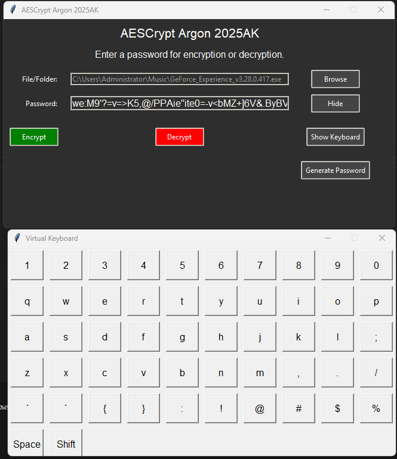

# AESCrypt Argon 2025AK - The Ultimate Encryption Solution

**AESCrypt Argon 2025AK** is an advanced encryption software developed for users who demand top-tier security, efficiency, and reliability. Whether you are an individual protecting personal files or an organization safeguarding critical data, this version is equipped with cutting-edge cryptographic techniques to meet your needs.

Unlike traditional encryption software, AESCrypt 2025AK integrates **AES-256-GCM**, a military-grade encryption standard, combined with **Argon2 password hashing**, ensuring the best protection against brute-force attacks. This release introduces massive improvements, including **per-block encryption**, **optimized multithreading**, **secure memory management**, **randomized padding**, and **enhanced keylogger protection**.

With a focus on both **security** and **user experience**, AESCrypt 2025AK provides a **dark mode UI**, a **virtual keyboard** for safer password input, **automated HMAC integrity validation**, and **secure file deletion techniques** that make recovery impossible.

⚠️ **Important Notice:** Due to the use of high-security encryption algorithms, **some antivirus software may flag AESCrypt 2025AK as a potential threat**, as its cryptographic behavior resembles that of ransomware. However, **AESCrypt is completely safe**, open-source, and does not contain any malicious code. If flagged, you may need to whitelist the software in your antivirus settings.

---

## 🚀 Why Choose AESCrypt 2025AK?

✔ **State-of-the-art AES-256 encryption with per-block IVs and authentication tags**
✔ **Random padding implementation to disguise file sizes**
✔ **Multithreaded processing for high-speed encryption and decryption**
✔ **Advanced secure file deletion to prevent forensic recovery**
✔ **Built-in virtual keyboard to protect against keyloggers**
✔ **Dark mode UI for better user experience**
✔ **Memory-safe implementations to eliminate key exposure in RAM**
✔ **HMAC verification for full integrity checks**
✔ **Works on all file types, including executables, archives, and media files**
✔ **Compatible with Windows and Linux**

---

## 📜 Table of Contents

1. [Overview](#overview)
2. [Key Features](#key-features)
3. [What's New in AESCrypt 2025AK](#whats-new-in-aescrypt-2025ak)
4. [Installation](#installation)
   - [Prerequisites](#prerequisites)
   - [Installing from Source](#installing-from-source)
5. [Download](#download)
6. [Usage](#usage)
   - [Encrypting Files](#encrypting-files)
   - [Decrypting Files](#decrypting-files)
   - [Secure File Deletion](#secure-file-deletion)
7. [Changelog](#changelog)
8. [Troubleshooting](#troubleshooting)
9. [Security Notes](#security-notes)
10. [License](#license)
11. [Contact](#contact)

---

## 📥 Download

Get the latest version of AESCrypt 2025AK:

- **Release Page:** [AESCrypt Argon 2025AK](https://github.com/victormeloasm/AESCrypt/releases/tag/Argon2025)
- **Windows:** [AEScrypt Windows v2025AK](https://github.com/victormeloasm/AESCrypt/releases/download/Argon2025/AEScrypt_Windows_v2025AK.zip)
- **Linux:** [AEScrypt Linux v2025AK](https://github.com/victormeloasm/AESCrypt/releases/download/Argon2025/AEScrypt_Linux_v2025AK.zip)

---

## 🔍 Overview

**AESCrypt Argon 2025AK** is designed to provide high-performance encryption while maintaining usability. This version ensures every file is encrypted with a unique IV and authentication tag per block, preventing tampering and unauthorized access. Large files are processed efficiently using parallelized cryptographic operations, making AESCrypt a perfect solution for securing vast amounts of data.

**New in this release:**
- **Memory-safe key derivation with Argon2**
- **Advanced file integrity checks using HMAC**
- **Virtual keyboard for anti-keylogger protection**
- **Enhanced deletion algorithms to make data recovery impossible**

---

## 🔐 Key Features

### 🛡️ Military-Grade Encryption
- **AES-256-GCM Encryption** – Ensures confidentiality, integrity, and authenticity.
- **Per-Block IVs & Authentication Tags** – Each block (1MB) gets unique security properties.
- **Argon2-Based Key Derivation** – Protects against brute-force and dictionary attacks.
- **HMAC Validation** – Verifies the authenticity of encrypted files.

### 🚀 Performance Optimization
- **Multithreaded Encryption & Decryption** – Speeds up processing significantly.
- **Parallelized Cryptographic Operations** – Optimized for large file encryption.
- **Memory-Safe Key Handling** – Uses `memoryview()` to reduce exposure in RAM.

### 🔏 Advanced Security Measures
- **Random Padding Implementation** – Prevents size-based attacks.
- **Secure File Deletion** – Overwrites files multiple times before removal.
- **Antivirus Safe (False Positives Expected)** – Uses high-level encryption techniques.
- **Virtual Keyboard Input** – Prevents password theft via keyloggers.

### 🎨 Enhanced User Experience
- **Dark Mode UI** – Modern, sleek design for easy use.
- **Toggle Password Visibility** – Manage encryption keys easily.
- **Built-in Password Generator** – Ensures strong encryption passwords.

---

## 🛠️ Troubleshooting

| Issue | Possible Solution |
|-------|------------------|
| **Antivirus detects AESCrypt** | Whitelist the application in your AV settings. It is a false positive. |
| **HMAC check failed** | Ensure you entered the **correct password**. The file may have been tampered with. |
| **File not found error** | Verify the file path and permissions. |

---

## 🔑 Security Notes

🔹 **Use strong passwords!** Encryption is only as strong as the password used.  
🔹 **Back up important files!** Encrypted data cannot be recovered without the password.  
🔹 **False Positives in Antivirus Software:** This is expected due to high-security encryption techniques.  

---

## 📬 Contact & Support

For any questions, suggestions, or issues, contact:  
📧 **Email:** [victormeloasm@gmail.com](mailto:victormeloasm@gmail.com)  
🐙 **GitHub Issues:** [Open a new issue](https://github.com/victormeloasm/AESCrypt/issues)

---

🚀 **Secure your data with AESCrypt 2025AK – The most advanced encryption software available!**
