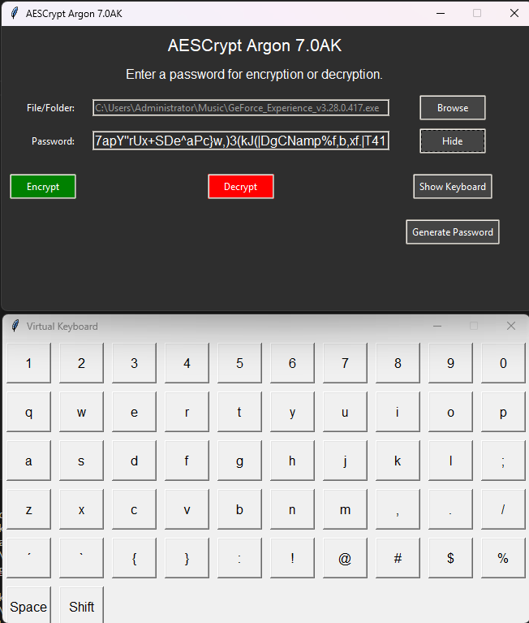

# AESCrypt Argon 7.0AK REV (Anti-Keylogger Revolution)

**AESCrypt Argon 7.0AK REV** is the ultimate encryption tool for individuals and organizations seeking robust, state-of-the-art file and folder encryption. This release brings revolutionary updates, including advanced block encryption techniques, enhanced multithreading performance, and a fortified user interface designed to thwart modern cyber threats, such as keyloggers.

This version incorporates **per-block encryption security**, multithreaded decryption optimization, **expanded HMAC validation**, and a more intuitive **dark mode** interface. Whether you're securing small files or handling terabytes of sensitive data, **AESCrypt 7.0AK REV** ensures unparalleled privacy and efficiency.



[Visit the AESCrypt Website](https://aescrypt-argon.netlify.app/)

---

## Table of Contents

1. [Overview](#overview)
2. [Key Features](#key-features)
3. [New in 7.0AK REV](#new-in-70ak-rev)
4. [Installation](#installation)
   - [Prerequisites](#prerequisites)
   - [Installing from Source](#installing-from-source)
5. [Download](#download)
6. [Usage](#usage)
   - [Encrypting Files](#encrypting-files)
   - [Decrypting Files](#decrypting-files)
   - [Encrypting Folders](#encrypting-folders)
   - [Advanced HMAC Validation](#advanced-hmac-validation)
7. [Changelog](#changelog)
8. [Troubleshooting](#troubleshooting)
9. [Contributing](#contributing)
10. [Security Notes](#security-notes)
11. [License](#license)
12. [Contact](#contact)

---

## Overview

**AESCrypt Argon 7.0AK REV** builds on the secure foundations of Argon 6.5AK by introducing enhanced per-block encryption, increased performance through multithreading, and greater resilience against tampering and unauthorized access. This version introduces an entirely revamped architecture for handling large files, with individual encryption and authentication for each block.

By combining **Argon2**, the most secure password hashing algorithm, with **AES-256**, a gold standard in encryption, **AESCrypt 7.0AK REV** provides the ultimate assurance that your files remain private and untouchable. Designed with an intuitive graphical interface and fortified with Anti-Keylogger (AK) protections, it is a must-have tool for anyone concerned about cybersecurity.

---

## Key Features

### Robust Security
- **AES-256 Encryption**: Files are encrypted using the most trusted encryption algorithm.
- **Argon2 Password Hashing**: Passwords are hashed using high memory and computational costs to thwart brute-force attacks.
- **Per-Block IVs and Tags**: Each 1MB block has its own Initialization Vector (IV) and authentication tag, ensuring granular encryption and tamper detection.
- **HMAC Verification**: Expanded HMAC validation secures file integrity by authenticating all IVs, tags, and encrypted data.

### Advanced Functionality
- **Multithreading**: Both encryption and decryption operations leverage multiple CPU cores for enhanced speed, particularly for large files.
- **File Integrity Check**: Calculate and display SHA-256 checksums before and after encryption to ensure file integrity.
- **Secure Deletion**: Deletes files by overwriting them multiple times with random data, making recovery impossible.
- **Large File Compatibility**: Optimized to process files of any size seamlessly.

### User Experience
- **Dark Mode Interface**: Fully revamped GUI featuring a modern dark theme for a sleek and comfortable user experience.
- **Virtual Keyboard**: Protects against keyloggers by allowing secure password input through an on-screen keyboard with randomized layouts.
- **Password Management**: Generate secure, random passwords and toggle password visibility with ease.

---

## New in 7.0AK REV

### Major Improvements
1. **Per-Block Encryption**:
   - Each block (1MB) of a file now has a unique IV and authentication tag.
   - Enhances data security and tamper resistance, making it impossible to modify even a single block without detection.
   
2. **Expanded HMAC Validation**:
   - Validates IVs, tags, and encrypted data as a unified entity.
   - Prevents tampering or corruption of any part of the file during transmission or storage.

3. **Multithreaded Decryption**:
   - Fully parallelized decryption process handles blocks independently for optimal performance on modern CPUs.
   - Ideal for large files or batch decryption tasks.

4. **Memory and File Security**:
   - Uses **PyNaCl** for advanced secure memory erasure.
   - Improved file deletion with multi-pass overwrites (zeros, ones, random data).

5. **Enhanced Error Reporting**:
   - Provides detailed and actionable error messages for troubleshooting encryption or decryption issues.

---

## Installation

### Prerequisites

1. Install **Python 3.9+**.
   - Download: [python.org](https://www.python.org/downloads/).
   - Ensure you select "Add Python to PATH" during installation.
   
2. Install **Git** for cloning the repository.
   - Download: [git-scm.com](https://git-scm.com/).

### Installing from Source

```bash
git clone https://github.com/victormeloasm/AESCrypt.git
cd AESCrypt
pip install -r requirements.txt
```

---

## Download

Download pre-compiled binaries for Windows and Linux:

- **Release Page**: [AESCrypt Argon 7.0AK REV](https://github.com/victormeloasm/AESCrypt/releases/tag/ArgonREV)
- **Windows**: [AEScrypt Windows v7.0AK](https://github.com/victormeloasm/AESCrypt/releases/download/ArgonREV/AEScrypt_Windows_v7.0AK.zip)
- **Linux**: [AEScrypt Linux v7.0AK](https://github.com/victormeloasm/AESCrypt/releases/download/ArgonREV/AEScrypt_Linux_v7.0AK.zip)

---

## Usage

### Encrypting Files
1. Launch the application.
2. Select a file via the **Browse File** button.
3. Enter a password or click **Generate Password** for a random one.
4. Click **Encrypt**. The encrypted `.aes` file will be saved in the same directory.

### Decrypting Files
1. Select the `.aes` file via **Browse File**.
2. Enter the password used for encryption.
3. Click **Decrypt** to restore the original file.

### Encrypting Folders
1. Select a folder via the **Browse Folder** button.
2. Enter a password or generate one.
3. Click **Encrypt** to encrypt all files inside the folder.

---

## Changelog

### Version 7.0AK REV (January 11, 2025)
#### Security Enhancements
- Introduced **per-block IVs and tags** for tamper-proof encryption.
- Expanded **HMAC verification** to authenticate all encryption parameters.

#### Performance Upgrades
- Full multithreading support for encryption and decryption.
- Optimized processing for files exceeding 500MB.

#### UI and Usability
- Added a **dark mode theme** for improved user experience.
- Introduced a virtual keyboard for secure password entry.

#### Bug Fixes
- Fixed issues with decryption of large files.
- Resolved memory leakage in encryption workflows.

---

## Troubleshooting

### Common Issues
- **"HMAC Check Failed"**: Ensure you’re using the correct password. The file may have been tampered with.
- **"File Not Found"**: Check the file path and permissions.

---

## Security Notes

- **Keep Passwords Safe**: Use strong, unique passwords.
- **Backup Encrypted Files**: Always maintain backups of your encrypted files.

---

## License

This project is licensed under the MIT License. See the [LICENSE](LICENSE) file for details.

---

## Contact

For issues, suggestions, or support, email us at: [victormeloasm@gmail.com](mailto:victormeloasm@gmail.com)

